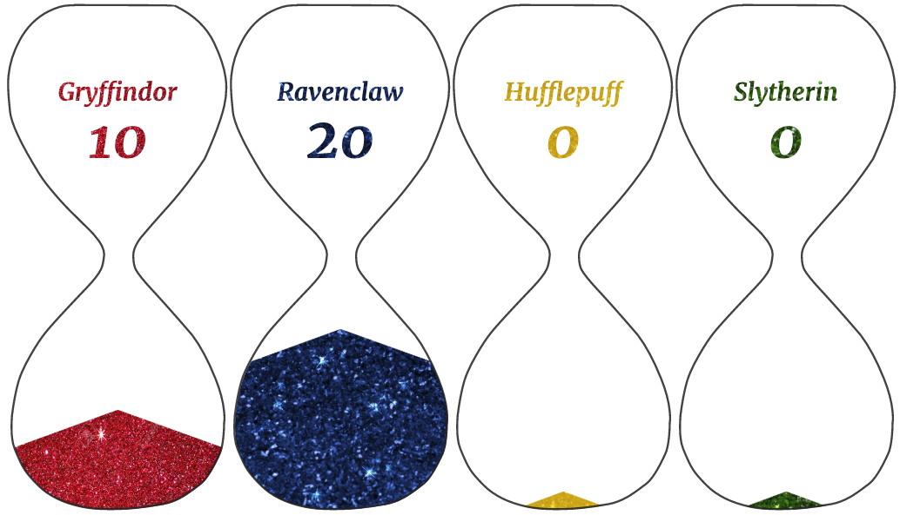

##Housepoints

A Slack bot for awarding house points

1. Make a new Slack App at `https://api.slack.com/apps`
1. Give it the Event Subscription (reaction added), Bot, and Interactivity permissions
1. Install requirements with `pip install -r requirements.txt`
1. Run `python dbinit.py` to create and seed a database with houses
1. Run `flask run` and browse to http://localhost:5000 to see it in action

